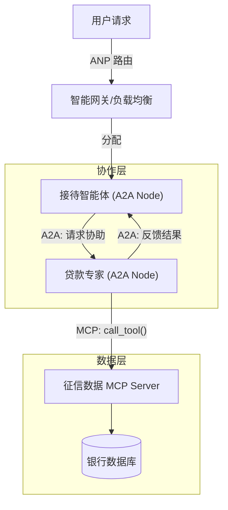

# 第十章：智能体通信协议 - 学习问答与实践

## 一、 协议对比与场景选择 (10.1.2)

### 1. 三种协议的设计理念分析

*   **MCP (Model Context Protocol) - "上下文共享"**
    *   **设计理念**: 旨在标准化大型语言模型 (LLM) 与外部数据和工具之间的连接。它将本地或远程的工具、资源抽象为模型可以理解的统一上下文格式。
    *   **解决核心问题**: 解决了 LLM "幻觉"问题和无法访问私有/最新数据的问题。通过标准化的 `list_tools`, `read_resource` 等接口，让模型能够安全、统一地获取外部能力，而无需为每个工具编写特定的集成代码。
    *   **代码体现**: 见 `my_mcp_server.py`，通过 `@mcp.tool()` 装饰器将可以直接执行的 Python 函数暴露给模型。

*   **A2A (Agent-to-Agent Protocol) - "对话式协作"**
    *   **设计理念**: 模仿人类团队的协作模式，定义了智能体之间发起任务、协商、反馈结果的消息标准。
    *   **解决核心问题**: 解决了单一智能体能力有限，需要多角色（如研究员、撰写员、审稿人）协同完成复杂长流程任务的问题。
    *   **代码体现**: 见 `09_A2A_Network.py`，定义了 `researcher`, `writer` 等角色，通过 `execute_skill` 进行点对点的任务委托。

*   **ANP (Agent Network Protocol) - "网络拓扑"**
    *   **设计理念**: 关注大规模智能体系统的组织结构、服务发现和负载均衡。类似于互联网的 TCP/IP 或微服务架构中的服务网格。
    *   **解决核心问题**: 解决了智能体数量激增时的管理难题。如何找到提供特定服务的智能体？如何避免单点过热？如何处理节点上下线？
    *   **代码体现**: 见 `11_ANPInit.py` 和 `registry` 机制，关注 `metadata` (负载、价格) 和 `discovery`。

### 2. 智能客服系统架构设计

针对需求，推荐的协议组合如下：

| 功能需求 | 推荐协议 | 选择理由 |
| :--- | :--- | :--- |
| **(1) 访问客户数据库和订单系统** | **MCP** | 数据库和订单系统是静态资源和确定的工具操作。MCP 最适合将这些具体的数据接口标准化暴露给处理业务的智能体，确保数据调用的准确性和安全性。 |
| **(2) 多个专业客服智能体协作** | **A2A** | 处理复杂客诉可能涉及"初级客服"、"退款专员"、"技术支持"等角色。A2A 提供了明确的对话和任务交接机制，适合这种流程化的协作。 |
| **(3) 支持大规模并发用户请求** | **ANP** | 面对大规模并发，不能依赖单一的客服实例。需要 ANP 来管理成百上千个客服智能体实例，进行请求分发（负载均衡）和动态扩容。 |

### 3. 组合使用方案与架构图

**应用场景**: 银行智能客服中心

*   **架构流程**:
    1.  **用户接入层 (ANP)**: 用户请求进入系统，ANP 网关根据当前负载，将请求路由到较空闲的"接待组"节点。
    2.  **业务处理层 (A2A)**: 接待智能体分析需求，如果是复杂贷款查询，通过 A2A 协议呼叫"贷款专家"智能体协助。
    3.  **数据访问层 (MCP)**: "贷款专家"智能体需要查询用户征信，它不直接连 SQL，而是通过 MCP Client 连接内部的"数据服务 MCP Server"，调用 `query_credit_score` 工具。

**架构图**:



---

## 二、 MCP 协议深入与实践 (10.2)

### 1. 扩展 MCP 服务器 (数据分析工具箱)

基于 `10.2.3` 节和 `my_mcp_server.py` 的扩展实现：

```python
from fastmcp import FastMCP
import json

# 定义一个新的 MCP 服务器
analytics_mcp = FastMCP("DataAnalyticsSuite")

# 模拟数据库
MOCK_DB = {
    "sales": [{"month": "Jan", "amount": 100}, {"month": "Feb", "amount": 120}],
    "users": [{"id": 1, "name": "Alice"}, {"id": 2, "name": "Bob"}]
}

# (1) 数据库查询工具
@analytics_mcp.tool()
def query_database(table: str, query_filter: str = None) -> str:
    """查询模拟数据库中的数据"""
    if table not in MOCK_DB:
        return f"Error: Table {table} not found."
    data = MOCK_DB[table]
    # 简化的过滤逻辑
    return json.dumps(data)

# (2) 数据可视化工具 (模拟生成图表代码或链接)
@analytics_mcp.tool()
def generate_visualization(data_json: str, chart_type: str) -> str:
    """根据数据生成图表配置"""
    try:
        data = json.loads(data_json)
        # 实际场景可能会调用 Matplotlib 或生成 ECharts 配置
        config = {
            "type": chart_type,
            "data": data,
            "title": "Generated Analysis Chart"
        }
        return f"Chart Config: {json.dumps(config)}"
    except Exception as e:
        return f"Error visualizing: {str(e)}"

# (3) 报表生成工具
@analytics_mcp.tool()
def generate_report(analysis_text: str, chart_config: str) -> str:
    """生成最终的 Markdown 报表"""
    report = f"""
# 数据分析报告
## 分析结论
{analysis_text}

## 数据图表
```json
{chart_config}```
"""
    return report

if __name__ == "__main__":
    # analytics_mcp.run() # 实际运行时取消注释
    pass
```

### 2. Resources 与 Prompts 的应用设计

**概念理解**:
*   **Resources (资源)**: 被动的数据源。类似于文件读取，提供上下文信息（如日志文件、API文档、系统配置），供 LLM 读取以增强理解。
*   **Prompts (提示)**: 预定义的思维模板。将最佳实践的 Prompt 封装在服务器端，让客户端直接复用（例如："代码审查标准Prompt"）。

**应用场景**: **自动化代码审计系统**
*   **Resources**: 项目的源代码文件、API 接口定义文档（Swagger）。
*   **Prompts**: "安全漏洞扫描 Prompt"（包含常见注入攻击的检查规则）。
*   **Tools**: `git_commit`, `issue_create`。
*   **流程**: 智能体 加载 "漏洞扫描 Prompt" -> 读取源代码 (Resource) -> 发现问题 -> 调用 `issue_create` (Tool) 提交修复建议。

### 3. JSON-RPC 与 Stdio 通信分析

*   **优势**:
    *   **简单通用**: 任何编程语言都支持 Stdio 和 JSON，无依赖，跨语言容易。
    *   **安全隔离**: 本地进程间通信，天然隔离了网络攻击面。
    *   **零配置**: 不需要配置端口、防火墙或服务发现。
*   **局限性**:
    *   **扩展性差**: 仅限于本机，无法跨机器调用。
    *   **无法复用**: 一个 MCP 进程通常只服务于启动它的那个父进程。
*   **远程扩展方案**:
    *   实现 **MCP over SSE (Server-Sent Events)** 或 **MCP over WebSocket**。
    *   在服务器端创建一个 HTTP 网关，将 HTTP 请求转换为内部的 JSON-RPC 消息，或者直接使用支持 HTTP 传输的 MCP SDK（如 `mcp-proxy`）。

---

## 三、 A2A 协议扩展与协作 (10.3)

### 1. 扩展案例：研究-撰写-审稿 三方协作

扩展 `10.3.4` 的代码逻辑：

```python
# 假设已有 researcher 和 writer 定义 (参考 09_A2A_Network.py)

# 1. 定义审稿人 (Reviewer)
reviewer = A2AServer(name="reviewer", description="审稿人")

@reviewer.skill("review")
def review_paper(content: str) -> str:
    """评审论文，返回意见和是否通过"""
    # 简单逻辑：如果包含'数据'字样则通过
    if "数据" in content:
        return str({"status": "accepted", "comments": "论据充分，通过。"})
    else:
        return str({"status": "rejected", "comments": "缺乏数据支持，请补充研究。"})

# 2. 协作流程控制器 (Main Agent)
def run_collaboration(topic):
    # 第一轮：研究与撰写
    res_data = researcher_client.execute_skill("research", topic)
    draft = writer_client.execute_skill("write", res_data['result'])
    
    # 第二轮：评审循环
    max_retries = 3
    for i in range(max_retries):
        review_res = reviewer_client.execute_skill("review", draft['result'])
        review_json = eval(review_res['result'])
        
        if review_json['status'] == 'accepted':
            print(f"论文最终定稿: {draft['result']}")
            break
        else:
            print(f"第 {i+1} 次退稿: {review_json['comments']}")
            # 反馈给 Writer 进行修改 (简化逻辑：追加数据)
            feedback = f"请根据意见修改: {review_json['comments']}. 原文: {draft['result']}"
            draft = writer_client.execute_skill("write", feedback)
```

### 2. 冲突解决机制设计

如果两个智能体意见不一致，A2A 协议可扩展以下消息类型：

*   `negotiation_request`: 发起协商，携带己方约束条件和可妥协范围。
*   `vote_cast`: 在多智能体场景下发起投票。

**机制设计**:
1.  **直接协商**: Agent A 拒绝 Agent B 的结果 -> 发送 `negotiation_request` -> 双方进行多轮对话，调整参数 -> 达成共识。
2.  **仲裁者模式**: 引入 `Judge Agent`。当检测到冲突（如陷入死循环）时，将双方的观点发给仲裁者，由仲裁者决定最终方案。

### 3. 与 AutoGen/CAMEL 的关系

*   **关系**: A2A 是**通信协议 (Protocol)**（类似于 HTTP），而 AutoGen 是**开发框架 (Framework)**（类似于 Django/Spring）。
*   **互操作方案**:
    *   开发一个 **"A2A Adapter"** (适配器)。
    *   将 AutoGen 的 `GroupChat` 封装为一个 A2A 节点。
    *   当外部 A2A 请求到达时，适配器将其转换为 AutoGen 内部的 Prompt，触发内部 Agents 讨论。
    *   讨论结果通过适配器封装回 A2A Response 返回。

---

## 四、 ANP 协议网络与治理 (10.4)

### 1. 网络拓扑分析与演进

*   **场景选择**:
    *   **星型 (Star)**: 适合**管理型/SaaS系统**。所有 Agent 注册到中心 Controller。易于监控计费，但有单点故障。
    *   **网状 (Mesh)**: 适合**去中心化/高隐私场景**。Agent 间直接 P2P 互联。抗毁性强，但发现机制复杂。
    *   **分层 (Hierarchical)**: 适合**超大规模/跨地域系统**。
*   **演进路径**:
    *   **10 个 Agent**: 使用**星型**。简单高效，一个 Discovery Server 即可。
    *   **1000 个 Agent**: 演进为**分层结构**。设立"区域中心" (Cluster Head)。本地流量在区域内解决（如"客服组A"内部通信），跨区域才经过上层路由。

### 2. 智能路由算法设计

算法逻辑：每个服务节点都有 `score`，选择 `score` 最高的节点。

```python
def select_best_node(candidates, task_priority="balanced"):
    best_node = None
    max_score = -1
    
    for node in candidates:
        # 获取指标 (归一化 0-1)
        load = node.metadata.get("cpu_load", 0.5)
        latency = node.metadata.get("network_delay", 0.1)
        capability = node.metadata.get("capability_score", 0.8) # 匹配度
        cost = node.metadata.get("price_per_token", 0.1)
        
        # 权重设置
        if task_priority == "speed":
            w_load=0.4, w_lat=0.5, w_cost=0.1
        elif task_priority == "cheap":
            w_load=0.2, w_lat=0.1, w_cost=0.7
        else:
            w_load=0.3, w_lat=0.3, w_cost=0.4
            
        # 计算得分 (负载和延迟越低越好，取反)
        score = (capability * 1.0) + ((1-load) * w_load) + ((1-latency) * w_lat) - (cost * w_cost)
        
        if score > max_score:
            max_score = score
            best_node = node
            
    return best_node
```

### 3. 容错机制设计 (智能城市案例)

针对交通管理 Agent 故障的容错三部曲：

1.  **故障检测 (Health Check)**: ANP 网络定期发送各个节点发送 `ping` 心跳包。如果交通 Agent 连续 3 次未响应，标记为 `Suspect`。
2.  **备份切换 (Failover)**: 系统中预先运行"备用交通 Agent"（Shadow Agent），处于热备状态（同步状态但不执行操作）。检测到主节点 Down 后，路由表立即指向备用节点的 ID。
3.  **优雅降级 (Degradation)**: 如果没有备用节点，系统自动降级模式。路灯控制不再依赖实时 AI 决策，而是回退到"固定定时器"模式，保证基础功能可用。

---

## 五、 安全性与信任 (10.2.4 & 10.4)

### 1. MCP 安全风险与控制

*   **风险**: `call_tool` 是任意代码执行的入口。如果 Server 提供了 `exec_shell` 或 `delete_file`，恶意的 LLM 或提示注入攻击可能导致系统被破坏。
*   **权限控制机制**:
    *   **Human-in-the-loop (HITL)**: 对于高危操作（High Risk Tag），MCP Client 在发送给 Server 之前必须弹窗请求用户人工确认。
    *   **Capability Scoping**: 启动 MCP Server 时，通过 flag 限制其只能访问特定目录（如 `--root /app/data`），类似于 Docker 的沙箱机制。

### 2. 端到端加密方案

*   **传输层**: 强制使用 mTLS (双向 TLS)。
*   **应用层 (Payload Encryption)**:
    *   发送方 Agent 生成对称密钥 $K$，用 $K$ 加密消息体 $M$。
    *   获取接收方 Agent 的公钥 $Pub_B$ (从 ANP Discovery 获取)。
    *   用 $Pub_B$ 加密 $K$。
    *   发送包：`{ "key": Enc(K), "data": Enc(M, K), "sign": Sign(Hash(M), Priv_A) }`。
    *   接收方验证签名（确保是 A 发的），解密 $K$，再解密消息。

### 3. 信任评估系统

设计一个去中心化的 **Reputation Ledger (信誉账本)**：

*   **评分维度**:
    *   **可用性**: 在线时长 / 总时长。
    *   **协作成功率**: 成功完成任务数 / 总任务数。
    *   **响应质量**: 下游 Agent 的反馈评分 (1-5星)。
*   **动态调整**:
    *   初始分：0.5。
    *   成功 +0.01，失败 -0.05 (惩罚更重)。
    *   **通信策略**:
        *   Trust > 0.8: 允许自动处理敏感数据。
        *   Trust < 0.4: 仅允许处理公开数据，且需人工审核。
        *   Trust < 0.2: 加入黑名单，拒绝路由。
