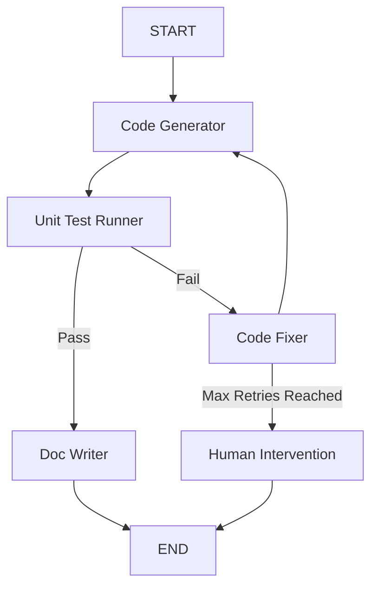

# Chapter 6 扩展思考与实践回答

## 1. AutoGen 案例扩展

### 1.1 动态协作流程设计 (Dynamic Workflow)

当前的 `RoundRobinGroupChat` 采用轮询方式，无法处理灵活的“返工”流程。要实现“动态回退”（例如：代码审查不通过 -> 回退给工程师 -> 再次审查），我们需要改变发言人选择策略。

**修改方案：**
推荐使用 **`SelectorGroupChat`** (在 Python SDK 中) 并配合自定义的 `selector_func` (发言人选择函数)。

**设计思路：**
我们可以定义一个条件筛选函数来实现状态跳转逻辑。

```python
def selector_func(messages, groupchat):
    last_msg = messages[-1]
    last_speaker = last_msg.source

    # 逻辑：如果代码审查不通过，强制回退给工程师
    if last_speaker == "CodeReviewer":
        if "不通过" in last_msg.content or "需修改" in last_msg.content:
            return "Engineer"
        else:
            return "QualityAssurance" # 审查通过，流转给QA
            
    # 逻辑：如果测试不通过，回退给工程师
    if last_speaker == "QualityAssurance":
        if "测试失败" in last_msg.content:
            return "Engineer"
            
    # 默认逻辑：让 LLM 或其他规则决定
    return None

# 初始化
selector_group_chat = SelectorGroupChat(
    participants=[product_manager, engineer, code_reviewer, qa],
    selector_func=selector_func,
    ...
)
```

对于更复杂的流程，可以使用 AutoGen 的 **Graph** 概念（在 .NET 版中显式支持），或在 Python 中通过配置 `allowed_speaker_transitions_dict` 字典来限制合法的发言跳转路径，构建一个有向图。

### 1.2 添加测试工程师 (QA) 角色

**系统消息设计：**

```python
def create_qa_engineer(model_client):
    system_message = """你是一位细致的测试工程师 (QA)，负责在代码审查通过后运行自动化测试。

    你的职责：
    1. **编写测试用例**: 根据需求编写单元测试或集成测试脚本。
    2. **执行测试**: 模拟运行代码（或请求用户代理运行）并记录结果。
    3. **报告缺陷**: 清晰地描述Bug复现步骤和预期结果。

    工作流程：
    - 收到 "代码审查完成" 的消息后介入。
    - 如果测试通过，请回复 "测试通过，准备上线"。
    - 如果测试失败，请详细列出失败原因，并说 "测试失败，请工程师修复"。
    """
    
    return AssistantAgent(
        name="QualityAssurance",
        model_client=model_client,
        system_message=system_message
    )
```

我们将 QA 加入 GroupChat，并更新 `CodeReviewer` 的提示词，使其在通过审查后将接力棒交给 QA。

### 1.3 对话质量监控机制

为了防止对话偏离主题或死循环，可以设计一个“监控者”机制：

1.  **基于规则的监控**:
    *   **最大轮次限制**: AutoGen 已自带 `max_turns`。
    *   **内容重复检测**: 检查最近 N 条消息的相似度，如果过高则强制打断或提示“请推进进度”。
2.  **基于 LLM 的元监控**:
    *   引入一个 hidden agent (例如 `Manager`)，不直接参与业务对话，但每隔 K 轮对当前对话历史进行一次 summary 和 evaluation。
    *   如果发现偏题，Manager 插入一条系统指令："大家似乎偏离了关于 [任务目标] 的讨论，请回到正题。"

## 2. AgentScope 案例分析

### 2.1 消息驱动架构 (MsgHub) 的优势

**优势：**
1.  **解耦 (Decoupling)**: 实现了发布/订阅模式，发送者不需要知道接收者是谁。
2.  **广播机制 (Broadcasting)**: `MsgHub` 天然支持消息广播。在狼人杀中，一名玩家发言，所有在同一 Hub 内的 Agent 都能即时收到。
3.  **异构集成**: 通过 **A2A (Agent-to-Agent) Protocol**，AgentScope 支持分布在不同进程甚至不同服务器上的 Agent 进行标准化通信。

**高价值场景：**
*   **多人实时交互系统**: 聊天室、多人游戏（如狼人杀）。
*   **分布式/微服务 AI 系统**: 需要跨网络、跨语言环境调用的智能体集群。
*   **开放世界模拟**: NPC 之间非线性的动态交互。

### 2.2 设计“猎人”角色与结构化输出

猎人角色：当被淘汰时，可以选择开枪带走一名玩家。

```python
# 猎人的结构化输出模型
class HunterActionModelCN(BaseModel):
    """中文版猎人技能行动格式"""
    
    shoot: bool = Field(
        description="是否发动技能开枪带人（仅在自己死亡时有效）",
    )
    target: Optional[str] = Field(
        description="开枪射击的目标玩家姓名。如果不发动技能，此项为None",
        default=None
    )
    last_word: str = Field(
        description="遗言或开枪时的台词",
    )
    reason: Optional[str] = Field(
        description="选择射击该目标的理由",
        default=None
    )

# 验证规则：
# 1. 如果 shoot 为 True，target 必须是非空且在存活玩家列表中。
# 2. 如果 shoot 为 False，target 应当忽略。
```

### 2.3 分布式部署的挑战与对策

在“三国狼人杀”实时游戏场景中，分布式部署（不同 Agent 运行在不同服务器或进程）挑战包括：

1.  **通信协议与发现**:
    *   *挑战*: Agent 分布在不同节点，如何找到彼此？
    *   *对策*: AgentScope 提供了 **A2A (Agent-to-Agent) Standard Protocol**，定义了统一的寻址和消息格式（Request/Response），支持跨网络调用。
2.  **状态一致性 (Consistency)**:
    *   *挑战*: 所有玩家看到的“存活列表”必须一致。
    *   *对策*: 实现自定义的 **Waitable Shared Memory** 或使用 `MessageStorageBase` 的持久化实现（如对接 Redis 或分布式数据库），确保由单一真理源（Single Source of Truth）管理游戏全局状态（Game State）。
3.  **消息时序性 (Ordering)**:
    *   *挑战*: 网络延迟可能导致消息乱序。
    *   *对策*: 引入逻辑时钟 (Logical Clock) 或依赖中心化的消息队列 (Message Queue) 进行定序。

## 3. CAMEL 案例深度思考

### 3.1 冲突解决机制

当两个智能体意见不一致（如关于终止条件）时：

1.  **引入仲裁者 (Moderator/Supervisor)**: 增加第三个 Agent，专门负责判断是否达成了任务目标。仅当仲裁者发出 DONE 信号时才结束。
2.  **双重确认 (Double Confirmation)**: 修改终止检查逻辑，要求**连续**两条消息都包含终止意图，或者双方都在其结构化输出中标记 `status="finished"`。
3.  **最大投票权**: 设定 User Role（作家）拥有最终决定权，如果作家说继续，即使心理学家想结束也必须继续。

### 3.2 Workforce 模块 vs AutoGen GroupChat

*CAMEL Workforce 是 CAMEL 框架向多采用 **层级化结构 (Hierarchical Structure)**。Workforce 通常包含一个中心化的 **Coordinator Agent**（协调者），负责任务分解、分配和管理子 Agent（Workers）。它可以动态创建 Worker 或分配任务给已注册的 Specialized Task Agents。这是一种“自上而下”的指挥体系。
    *   **AutoGen GroupChat**: 采用 **扁平化讨论结构 (Flat Discussion Structure)**。虽然有 Manager，但其核心更像是一个会议室，通过 `Selector`（LLM 或规则）决定下一个谁发言。它更侧重于对话流的接力。
*   **协作模式**:
    *   CAMEL Workforce 倾向于 **Task-Oriented (任务导向)** 的流水线。协调者分配 -> 工人执行 -> 协调者汇总。
    *   AutoGen GroupChat 倾向于 **Discussion-Oriented (讨论导向)** 的多轮迭代和头脑风暴言。虽然 AutoGen 也有 `GroupManager`，但其核心隐喻是“群聊”。
*   **协作模式**:
    *   CAMEL Workforce 倾向于 **Task-Oriented (任务导向)** 的流水线或分治协作。
    *   AutoGen GroupChat 倾向于 **Discussion-Oriented (讨论导向)** 的头脑风暴或迭代式协作。

## 4. LangGraph 案例分析

### 4.1 理解-搜索-回答 图结构

```text
[START] 
  |
  v
(understand_query_node) [状态: User Query -> Search Keywords]
  |
  v
(tavily_search_node)    [状态: Keywords -> Search Results]
  |
  v
(generate_answer_node)  [状态: Results -> Final Answer]
  |
  v
 [END]
```

*   **节点 (Nodes)**: Understand, Search, Answer
*   **边 (Edges)**: 直接的顺序边 (Sequential Edges)
*   **状态 (State)**: 包含 `messages`, `step`, `search_results` 等。

### 4.2 添加“反思”节点与循环

扩展流程：在线性流程末尾添加判断。

```python
# 伪代码逻辑

def reflection_node(state):
    # 评估答案质量
    score = llm.evaluate(state["final_answer"]) 
    return {"quality_score": score, ...}

def quality_gateway(state):
    if state["quality_score"] > 8:
        return END
    else:
        return "understand" # 或 "search"，退回到前面的步骤重试

# 构建图
workflow.add_node("reflect", reflection_node)
workflow.add_edge("answer", "reflect")
workflow.add_conditional_edges(
    "reflect",
    quality_gateway,
    {
        END: END,
        "understand": "understand"
    }
)
```

### 4.3 复杂循环场景设计：代码生成-测试-修复循环

**场景**: 自动化 Python 编程助手

**图结构**:



**关键节点功能**:
1.  **Code Generator**: 接收需求，输出 Python 代码。
2.  **Unit Test Runner**: 运行代码（在沙箱中），捕获 stdout/stderr 和 exit code。如果出错，将错误堆栈存入 State。
3.  **Code Fixer**: 读取 State 中的错误堆栈和原始代码，生成修复后的代码。
4.  **Condition**: 检查测试结果。如果 `Passed` -> 走向文档生成；如果 `Failed` -> 走向修复节点（并检查重试计数）。

## 5. 框架选型建议

假设你是一家 AI 公司的技术架构师：

### 应用 A：高并发智能客服系统
*   **推荐框架**: **LangGraph** (或自己基于 LangChain 封装)
*   **理由**:
    *   **控制力与稳定性**: 客服系统需要高度可控的回答流程，避免幻觉。LangGraph 的状态机机制能精确控制“意图识别 -> 知识库检索 -> 回答”的每一步。
    *   **性能**: LangGraph 轻量级，易于集成到现有的高性能 Web 服务（如 FastAPI）中。相比 AutoGen 等“多智能体对话”框架，它更适合处理单一请求内的确定性逻辑流程。
    *   **低延迟**: 流程是编排好的，没有多余的 Agent 互相客套的 Token 消耗。

### 应用 B：科研论文辅助写作平台
*   **推荐框架**: **CAMEL** 或 **AutoGen**
*   **理由**:
    *   **深度交互**: 论文写作需要两个角色（研究员与写作者）进行深度的思维碰撞、反复修改和多轮探讨。这正是 AutoGen 和 CAMEL 擅长的“Role-Playing”场景。
    *   **上下文管理**: 这些框架在处理长对话历史（Context Window）管理上有较成熟的封装。
    *   CAMEL 的 Inception 提示机制特别适合这种这就某一主题进行深入挖掘的场景。

### 应用 C：金融风控审批系统
*   **推荐框架**: **LangGraph**
*   **理由**:
    *   **流程严格性**: 金融审批是典型的 **DAG (有向无环图)** 或状态机场景。LangGraph 允许精确定义 `State` 和 `Node`，确保流程严格执行（如必须先风控后授信），绝无“幻觉”跳转。
    *   **可追溯与“时光倒流”** (Time Travel): LangGraph 的 Checkpointing 机制（如使用 `PostgresSaver` 或 `SqliteSaver`）不仅能持久化保存每一步的快照，还支持 **Time Travel Debugging**。如果审批出了问题，审计人员可以通过 `checkpoint_id` 精确重现当时的上下文，甚至从该点分叉执行（Fork）来模拟不同结果。
    *   **人机交互 (Human-in-the-loop)**: 原生支持中断（Interrupt），非常适合“人工复核”节点：计算完风险后暂停，等待人工 API 调用确认后继续。
